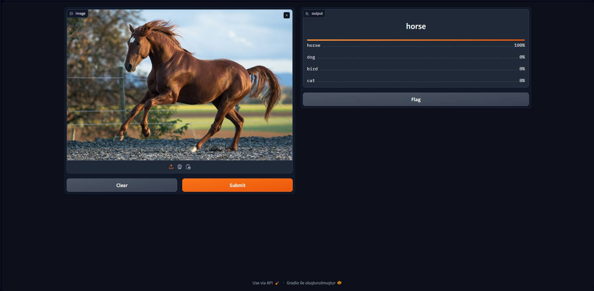

# Image Clasiffier With Pytorch

In this project, an image classifier was created using PyTorch. The model can classify images of horses, birds, cats, and dogs. After the model was created, a GUI was built using Gradio.

